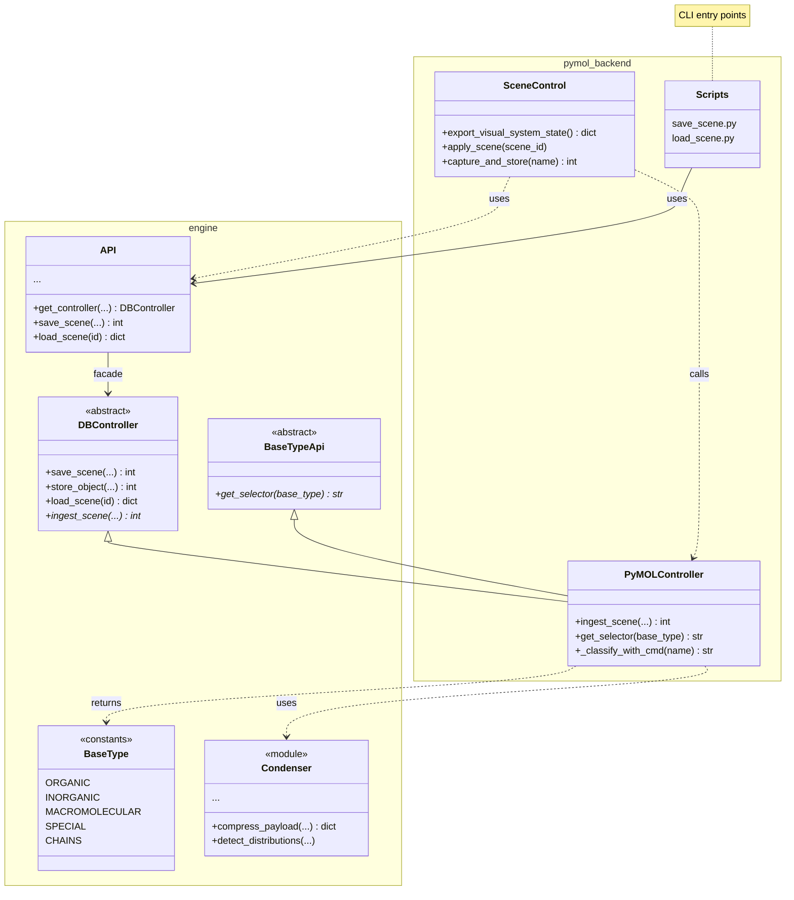

# Rendering as Code with PyMOL

A minimal Python project for "Rendering as Code with PyMOL".

## Architecture

Two layers:

* **`engine`** — renderer-agnostic layer with features:
  - **ABC interfaces**: storage, selector mapping
  - **`Models`**: BaseType constants, dataclasses
  - **`Condenser`**: compression/decompression middleware
  - **API**: thin singleton facade

* **`pymol-backend`** — concrete backend implementing engine ABCs:
  - **PyMOLController**: implements DBController + BaseTypeApi
  - **Classification**: maps objects to BaseType via chemistry detection
  - **Scene**: distribution-based scene application (capture, apply)
  - **Scripts**: CLI entry points for save/load/browse




## Usage


### 1. Setup, lint and test

For POSIX:

```bash
python3 -m venv .venv \
    && . .venv/bin/activate \
    && pip install --upgrade pip setuptools wheel \
    && pip install -e .[dev] \
    && ruff check . \
    && pytest -q
```

For Windows:

```powershell
python -m venv .venv; .\.venv\Scripts\Activate.ps1; pip install --upgrade pip setuptools wheel; pip install -e .[dev]; ruff check .; pytest -q
```

### 2. Quick run

```bash
python pymol-templates/simple.py
```

Checkout the other template scripts...


