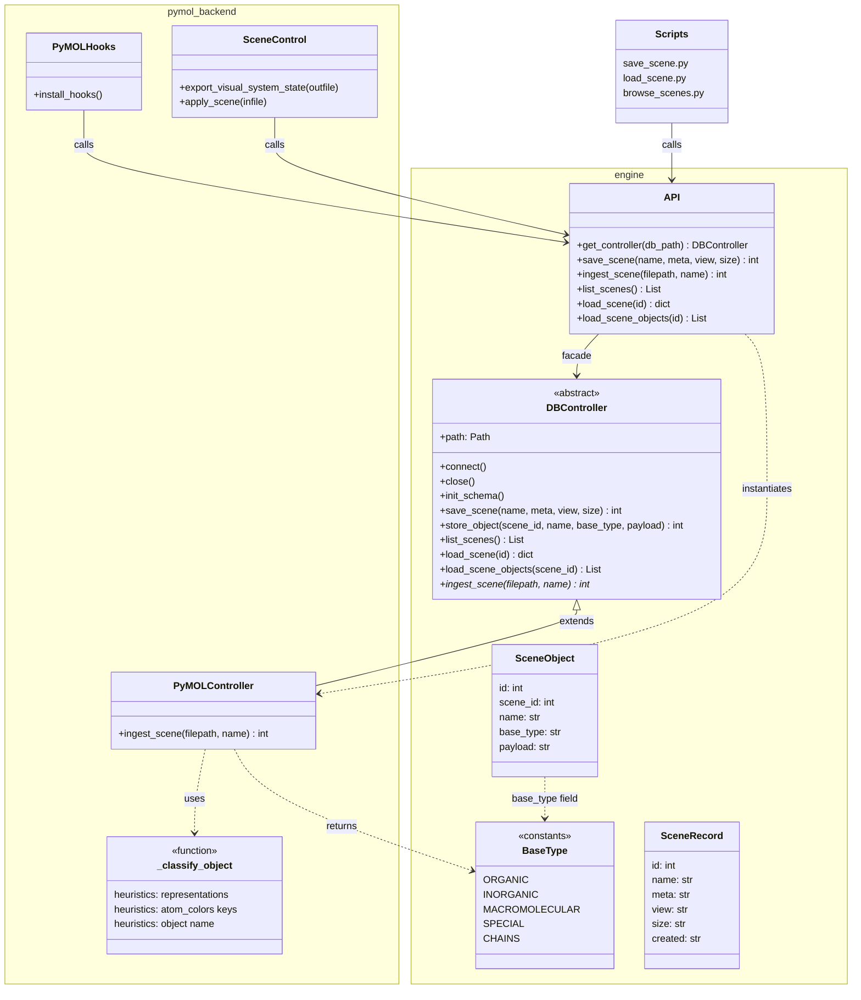

# Rendering as Code with PyMOL

A minimal Python project for "Rendering as Code with PyMOL".

## Architecture

Three layers, strict dependency direction — nothing in `engine/` imports from `pymol/`:

* **`engine/`** — renderer-agnostic ABC (`DBController`), typed models (`BaseType`, `SceneRecord`, `SceneObject`), and a thin singleton API.  Zero PyMOL knowledge.
* **`pymol/`** — first concrete backend.  `PyMOLController` subclasses `DBController`, implements `ingest_scene`, and classifies objects into `BaseType`.  `scene_control.py` and `pymol_hooks.py` are PyMOL-only and untouched by the engine.
* **Scripts** — CLI entry points that call `engine.api` only.  Swapping the backend requires changing one import line in `engine/api.py`.

## Usage

The simplest way to try the project is to start PyMOL (headless) and import the
module; you can then call `pymol.scene_control.export_scene()` and use the CLI
utilities to persist or restore the state.  See individual scripts for example
arguments.

