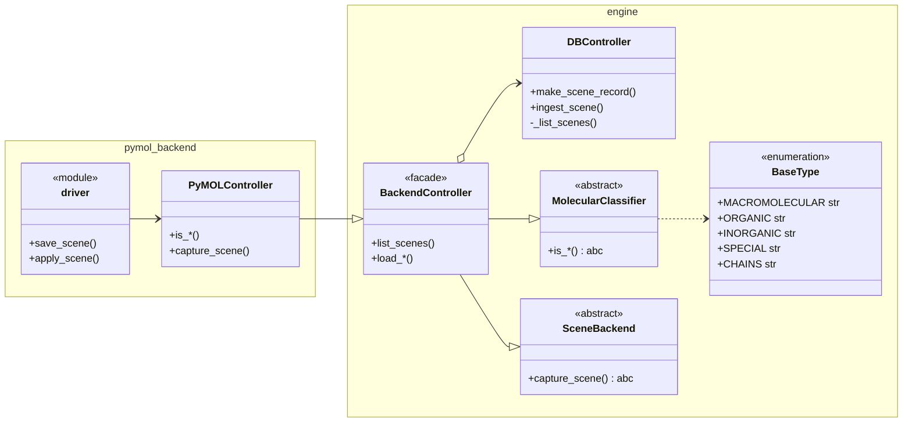

# Rendering as Code with PyMOL

A Python project for "Rendering as Code with PyMOL".   
### [**`Render Scenes ↗`**](https://ststevanovic.github.io/rac-pymol/)

<!-- ## [**`Try Scene Creator ↗`**](https://ststevanovic.github.io/rac-pymol/) -->
## 

## Architecture

Two layers:

* **`engine`** — renderer-agnostic core:
  - **`DBController`** (ABC) — SQL persistence
  - **`MolecularClassifier`** (ABC) — `is_*` slots + `classify_object`
  - **`SceneBackend`** (ABC) — `capture_scene` contract + `ingest_scene` wiring
  - **`BackendController`** — composes all three ABCs; backends subclass this only
  - **`BaseType`** — constants (`MACROMOLECULAR`, `ORGANIC`, `INORGANIC`, `SPECIAL`, `CHAINS`)

* **`pymol-backend`** — PyMOL concrete implementation:
  - **`PyMOLController`** — implements all ABC slots via `cmd` selectors; `capture_scene` reads `cmd.get_session()` once
  - **`driver`** — `save_scene` / `apply_scene` registered via `cmd.extend`




## Usage


### 1. Setup, lint and test

For POSIX:

```bash
python3 -m venv .venv \
    && . .venv/bin/activate \
    && pip install --upgrade pip setuptools wheel \
    && pip install -e .[dev] \
    && ruff check . \
    && pytest -q
```

For Windows:

```powershell
python -m venv .venv; .\.venv\Scripts\Activate.ps1; pip install --upgrade pip setuptools wheel; pip install -e .[dev]; ruff check .; pytest -q
```

### 2. Quick run

```bash
python pymol-workshop/simple.py
```

### 3. Local Render Server   
Use it to apply scenography from local environment  
```bash 
bash .github/scripts/setup_local.sh && bash .github/scripts/local.sh
```