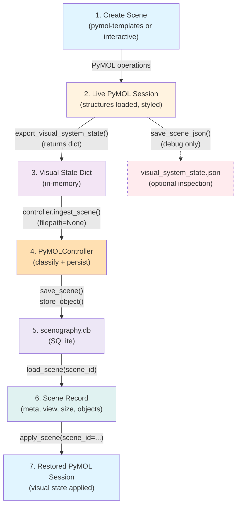

# PyMOL Backend

This package implements the PyMOL-specific concrete backend for the rendering-as-code engine. It handles all PyMOL-specific concerns: capturing visual state, ingesting scenes into the database, classifying molecular objects, and restoring scenes.

## Module Overview

### `__init__.py`
Package marker. Minimal initialization for the pymol backend package.

### `controller.py` (Core)
**Responsibility:** Implement the concrete `DBController` for PyMOL.

**Key Functions:**
- `PyMOLController.ingest_scene(filepath=None, name=None)` — Capture visual state from live PyMOL session (or load from JSON for debug) and persist to SQLite.
  - When `filepath=None`: captures directly from current PyMOL session via `scene_control.export_visual_system_state()`
  - When `filepath` provided: loads from JSON file (legacy/debug path)
- `_classify_object(obj_name, obj_data)` — Classify molecular objects into base types (MACROMOLECULAR, ORGANIC, SPECIAL, INORGANIC, CHAINS).
  - Prefers PyMOL `cmd` selection keywords when available (solvent, polymer, protein, nucleic).
  - Falls back to JSON-based heuristics for robustness when `pymol-open-source` is not installed or no live session exists.

**Dependencies:** `engine.controller`, `engine.models`, `pymol.cmd` (optional), `pymol.scene_control`.

**Data Flow:**
```
PyMOL Session → export_visual_system_state() → [parse + classify] → store_object() → SQLite
```

### `scene_control.py` (Export / Apply)
**Responsibility:** Capture and restore visual state snapshots from/to PyMOL.

**Key Functions:**
- `export_visual_system_state()` — Capture the current PyMOL session state and return as dict:
  - Global settings (ambient, specular, shininess, etc.)
  - Camera matrix and viewport
  - Per-object visual data: transformations, representations, atom colors, settings
  - **Primary workflow:** Returns data dict for direct ingestion by controller
  
- `save_scene_json(outfile)` — **Debug helper only**: Export visual state to JSON file for inspection.
  - Registered as PyMOL command: `save_scene_json`
  - NOT the primary workflow; use `controller.ingest_scene()` instead

- `apply_scene(scene_id=None, scene_name=None, db_path=None)` — Restore a visual state from scenography.db:
  - Loads scene by ID or name from the database
  - Re-applies global settings, camera, viewport
  - Restores per-object representations, colors, transformations
  - Registered as PyMOL command: `apply_scene`

**Dependencies:** `pymol.cmd`, `engine.api`.

**Usage:**
```python
# Primary workflow: capture and store directly to DB
from pymol.controller import PyMOLController
controller = PyMOLController(db_path="scenography.db")
scene_id = controller.ingest_scene(filepath=None, name="my_scene")

# Restore from DB
from pymol import scene_control
scene_control.apply_scene(scene_id=scene_id)
# or by name:
scene_control.apply_scene(scene_name="my_scene")

# Debug only: export to JSON for inspection
scene_control.save_scene_json("debug.json")
```

Or from the PyMOL CLI:
```
save_scene_json debug.json
apply_scene scene_id=1
apply_scene scene_name=my_scene
```

### `pymol_integration.py` (Auto-Setup)
**Responsibility:** Auto-configure database integration when pymol package is imported.

**Key Functions:**
- Auto-initializes database path to default `rac_pymol/db/scenography.db`
- Registers all PyMOL commands (capture_and_store, apply_scene, etc.)
- Provides status message with active database path

**Usage:**
```python
# Simply import to enable integration
import pymol.pymol_integration

# Now commands are available in PyMOL CLI
```

**Note:** Import happens automatically when you `import pymol` if PyMOL cmd is available.

---

## Correct Workflow



**Key Points:**
1. **JSON is optional** — Only for debug/inspection via `save_scene_json()`.
2. **Primary path** — Direct capture from PyMOL session → controller → database.
3. **Automation-friendly** — No manual file management; controller handles persistence.
4. **Restoration** — `apply_scene()` loads from database by scene ID or name.

---

## Architecture Principle

**Engine Abstraction:** The `engine/` package remains **completely renderer-agnostic**. It only knows:
- How to store opaque JSON payloads.
- How to store typed objects (base_type string + payload).
- SQLite schema.

**PyMOL Backend Responsibility:** `pymol/` handles all PyMOL-specific concerns:
- Direct capture from PyMOL session (no intermediate JSON required).
- Classification logic (using cmd selections or heuristics).
- Conversion from PyMOL's visual state to the engine's typed schema.
- Restoration from database to live PyMOL session.

This separation ensures that:
1. The engine can be reused for other renderers (Chimera, Maya, Blender, etc.).
2. PyMOL changes are isolated to the `pymol/` package.
3. Tests can mock PyMOL without affecting core engine tests.
4. **No file I/O required** — direct memory-to-database workflow for automation.

---

## Quick Start

### Tight Integration Mode (Recommended)

The pymol package auto-configures database integration on import:

```python
# In PyMOL or add to .pymolrc
import pymol.pymol_integration

# Capture current view and store to database (no JSON files)
capture_and_store my_protein_view

# Restore a scene by ID
apply_scene scene_id=1

# Or by name
apply_scene scene_name=my_protein_view
```

### Programmatic Usage

```python
from pymol import scene_control

# Capture and store directly to database
scene_id = scene_control.capture_and_store("my_view")
print(f"Stored as scene {scene_id}")

# Restore a scene
scene_control.apply_scene(scene_id=scene_id)
# or
scene_control.apply_scene(scene_name="my_view")
```

### Custom Database Path

By default, uses `rac_pymol/db/scenography.db` (shipped with repo).

To use a custom database:

```python
from pymol import scene_control
scene_control.setup_db("/path/to/custom.db")

# All subsequent operations use the custom path
scene_control.capture_and_store("my_view")
```

### List Available Scenes

```python
from engine.api import get_controller
controller = get_controller()  # Uses configured path
scenes = controller.list_scenes()
for scene in scenes:
    print(f"{scene['id']}: {scene['name']} (created: {scene['created']})")
```

### Debug: Export to JSON (Optional)

```python
from pymol import scene_control
scene_control.save_scene_json("debug_snapshot.json")
```

---

## Dependencies

- `pymol-open-source` — For `pymol.cmd` and selection API.
- `engine.controller`, `engine.models` — Shared abstract layer and dataclasses.

---

## Testing

- Unit tests in `tests/test_ingest.py` exercise `PyMOLController.ingest_scene()` with mock JSON data.
- No direct PyMOL session required for unit tests (JSON parsing is tested separately from live PyMOL).
- Integration tests would use `pymol -c` or a headless session to capture and restore scenes end-to-end.
